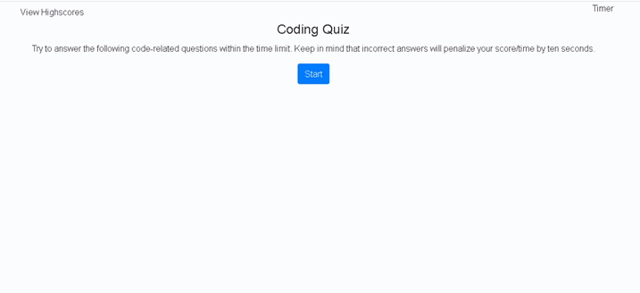

Code Quiz Javascript Program (Using DOM)

# Code Quiz Guidelines

This is an JavaScript application created to provide a timed coding assessment with multiple choice questions. The client requested the application include at least five questions and store scores in localStoage. They also requested that the application maintain a clean and polished user interface, that it was responsive, ensuring that it adapts to multiple screen sizes, and that it run in the browser, featuring dynamically updated HTML and CSS powered by the JavaScript code. 

The specific features of the application are outlined in the acceptance criteria provided by the client. 

# Acceptance Criteria Requirements:

Functional, deployed application includes the following:

* Timed quiz application displaying instructions, questions, and highscores

* A start button that begins a timer and presents a question

* Five questions that run sequentially and displays the next question once the current question is answered

* Displays whether a question is correct or incorrect

* 10 seconds is subtracted from the timer when an incorrect answer is chosen

* End of quiz occurs when all questions are answered or the timer reaches 0

* Score is calculated by the number of seconds left on the timer when the quiz ends

* Highscores are collected by prompting for initials and saving score

* Highscores are saved to localStorage and are able to be cleared 

* Highscores are able to be viewed at any time during the quiz

* User is able to return to the start at the end of the quiz

The following animation demonstrates the client's request for application functionality:

Client Demo:

Application Demo: 

Validation of Site Available Here: 

# Criteria Determination: 

This application provides a fully responsive JavaScript program for the client to test JavaScript knowledge while ensuring that responsiveness and utility is not affected. 

For additional information, please e-mail the project manager Summer Healey: summerleigh.healey@gmail.com

